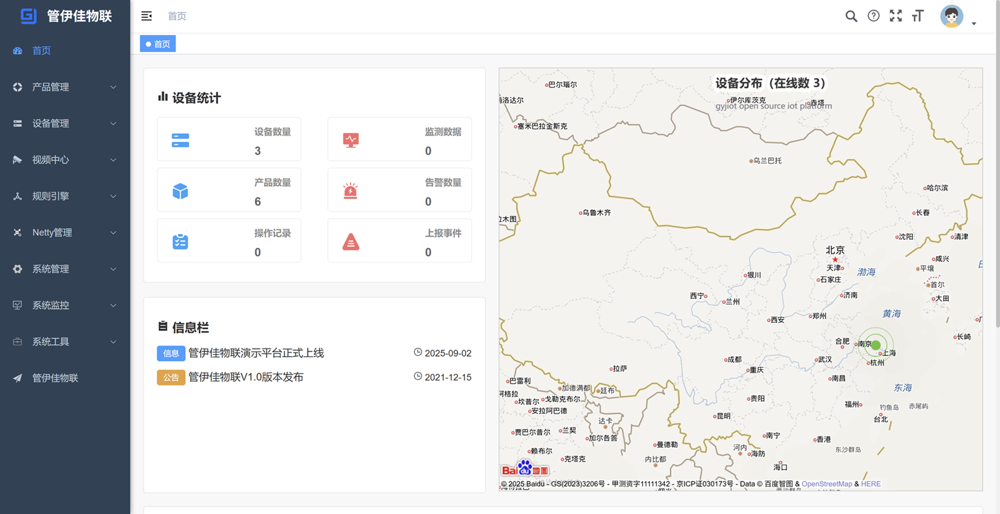
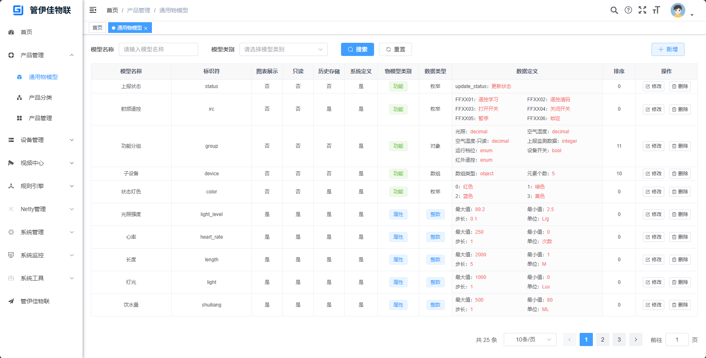
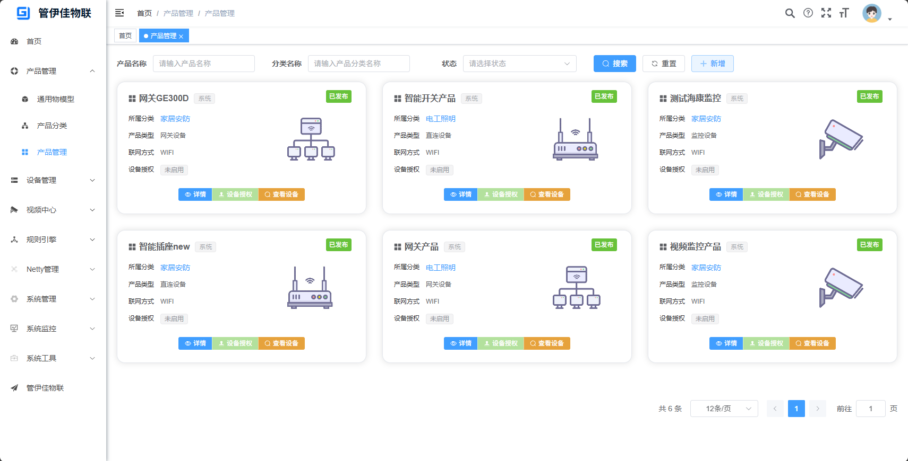
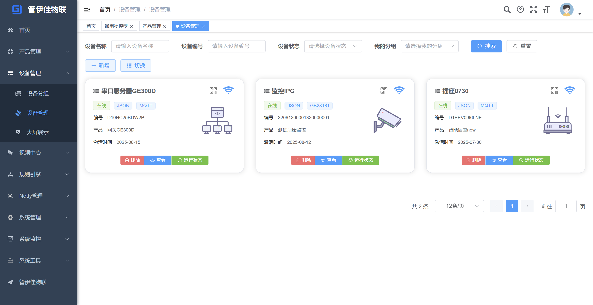
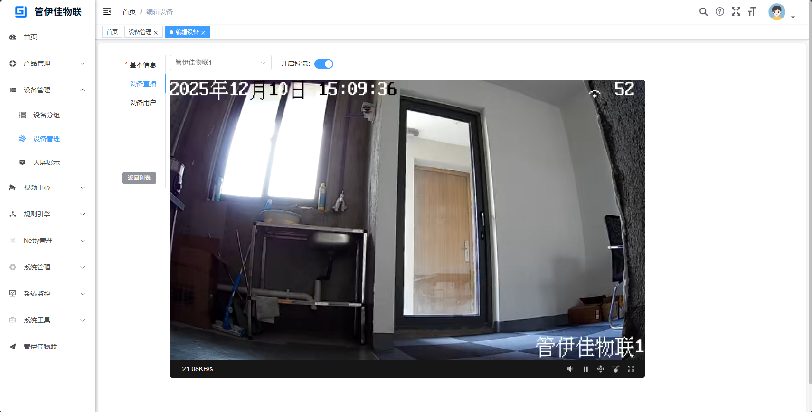
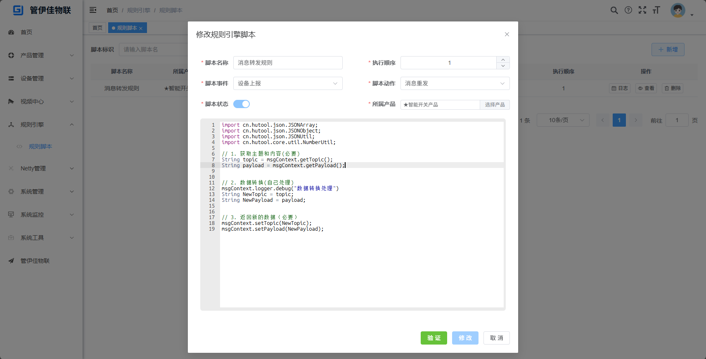
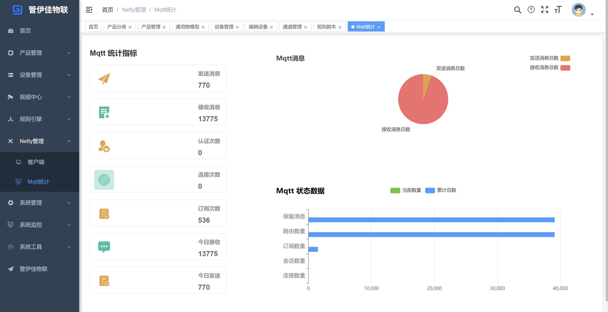
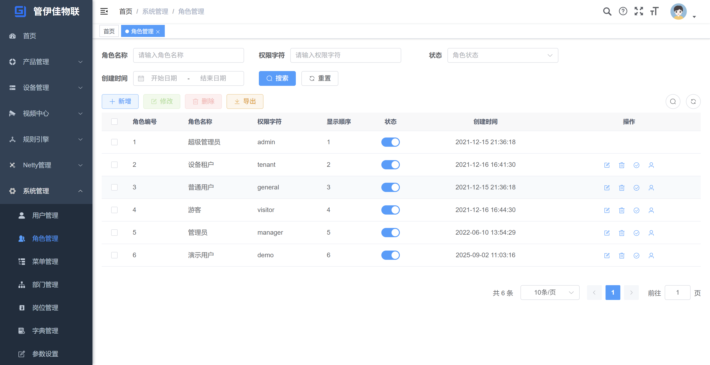

# 管伊佳物联

#### 项目介绍
管伊佳物联平台，简单易用，更适合中小企业和个人学习使用。大家记得点个Star，这对我们很重要！

适用于智慧工业、智能家居、智慧景区、智慧社区、智慧校园、农业监测、水利监测等。

深耕物联网行业多年，专业提供物联网解决方案，可信赖的智慧工业物联网伙伴。

系统后端采用Spring boot2.5，前端采用Vue3.4，Mqtt服务端使用netty搭建；

数据库采用Mysql8.0.24，设备端支持ESP8266、Modbus、GB28181等。

开源演示地址：http://8.159.145.155:20261  演示账号：gyj  密码：gyj123 欢迎进行试用体验！

全功能平台地址：http://iot.gyjerp.com  演示账号：gyj  密码：gyj123 欢迎进行试用体验！

QQ技术交流群：818914680 欢迎加入，一起学习！商务或技术交流，请联系微信：shenhua861584 QQ：752718920

#### 软件架构
* 服务端
- 相关技术：Spring boot2.5、MyBatis3.5、Spring Security、Mysql、Redis、Netty等
- 开发工具：IDEA
* Web端
- 相关技术：Vue3.4、Element-plus2.4、ES6、Vue-router、Vite、Axios、Echart等
- 开发工具：WebStorm 或者 Visual Studio Code


#### 系统功能

|           系统功能           | 功能说明                                            | 
|:------------------------:|:-----------------------------------------------:|
|           产品管理           | 通用物模型、产品分类、产品详情、设备授权、产品模型                       | 
|           设备管理           | 设备分组、设备详情、运行状态、设备定时、设备用户、事件日志、指令日志            | 
|          大屏展示           | 设备总览、设备分布、mqtt状态、mqtt消息、设备提醒、监测数据          | 
|          视频接入          | 基于GB28181协议支持主流厂商监控设备接入，实时播放| 
|          规则引擎          | 规则脚本、日志查看           | 
|          Netty管理          | 客户端、Mqtt统计 | 
|          权限管理          | 基于若依的权限管理系统，用户、角色、菜单、部门、岗位、权限、日志等  | 


#### 源码目录
```
gyj-iot-web/                          # 管伊佳物联网平台前端项目
├── html/                             # 静态HTML页面（IE兼容性提示等）
├── public/                           # 公共资源目录（不参与构建处理）
│   ├── js/                           # 第三方JS库（播放器、MQTT客户端等）
│   ├── screen/                       # 数据大屏展示图片资源
│   ├── styles/                       # 公共样式文件
│   └── favicon.ico                   # 网站图标
├── src/                              # 源代码目录（核心开发目录）
│   ├── api/                          # API接口定义（IoT、系统、监控等模块）
│   ├── assets/                       # 静态资源（图片、图标、样式）
│   ├── components/                   # 公共组件（表格、表单、上传等）
│   ├── directive/                    # 自定义指令（权限、通用指令）
│   ├── layout/                       # 布局组件（侧边栏、导航栏等）
│   ├── plugins/                      # 插件封装（权限、缓存、下载等）
│   ├── router/                       # 路由配置
│   ├── store/                        # 状态管理（Pinia）
│   ├── utils/                        # 工具函数（请求、验证、MQTT等）
│   └── views/                        # 页面视图（业务页面）
├── vite/                             # Vite构建插件配置
├── .env.development                  # 开发环境变量配置
├── .env.production                   # 生产环境变量配置
├── .env.staging                      # 测试环境变量配置
├── index.html                        # 入口HTML文件
├── package.json                      # 项目依赖与脚本配置
└── vite.config.js                    # Vite构建配置文件

gyj-iot-boot/
├── gyjiot-admin/              # 管理后台模块 - Web应用入口，提供系统管理界面和API接口
├── gyjiot-common/             # 通用工具模块 - 公共常量、工具类、异常处理、注解等基础组件
├── gyjiot-framework/          # 框架核心模块 - Spring Security、AOP切面、数据源配置等框架级功能
├── gyjiot-open-api/           # 开放API模块 - 对外提供的数据接口控制器和定时任务
├── gyjiot-gateway/            # 网关模块
│   ├── gateway-boot/          # 网关启动模块 - API网关服务入口
│   └── gyjiot-mq/             # 消息队列模块 - MQTT消息处理相关功能
├── gyjiot-plugs/              # 插件模块集合
│   ├── gyjiot-generator/      # 代码生成器 - 自动生成CRUD代码的工具
│   ├── gyjiot-http/           # HTTP客户端 - HTTP请求封装和处理
│   ├── gyjiot-mqtt-client/    # MQTT客户端 - MQTT协议客户端实现
│   ├── gyjiot-quartz/         # 定时任务 - Quartz调度器集成
│   └── gyjiot-ruleEngine/     # 规则引擎 - IoT设备数据处理规则引擎
├── gyjiot-protocol/           # 协议解析模块
│   └── gyjiot-protocol-collect/ # 协议采集 - 多协议数据采集和解析
├── gyjiot-server/             # IoT服务器模块
│   ├── base-server/           # 基础服务 - IoT设备管理基础功能
│   ├── boot-strap/            # 启动引导 - MQTT服务启动引导
│   ├── iot-server-core/       # 核心服务 - IoT服务器核心逻辑
│   ├── mqtt-broker/           # MQTT代理 - MQTT消息代理服务
│   └── sip-server/            # SIP服务 - 视频流SIP协议支持
└── gyjiot-service/            # 业务服务模块
    ├── gyjiot-iot-service/    # IoT业务服务 - 设备管理、数据采集等业务逻辑
    └── gyjiot-system-service/ # 系统管理服务 - 用户、角色、权限等系统管理
```

#### 系统截图
* 首页

* 通用物模型

* 产品管理

* 设备管理

* 监控直播

* 规则脚本

* Mqtt统计

* 权限管理


#### 参与贡献

1.  Fork 本仓库
2.  新建 Feat_xxx 分支
3.  提交代码
4.  新建 Pull Request