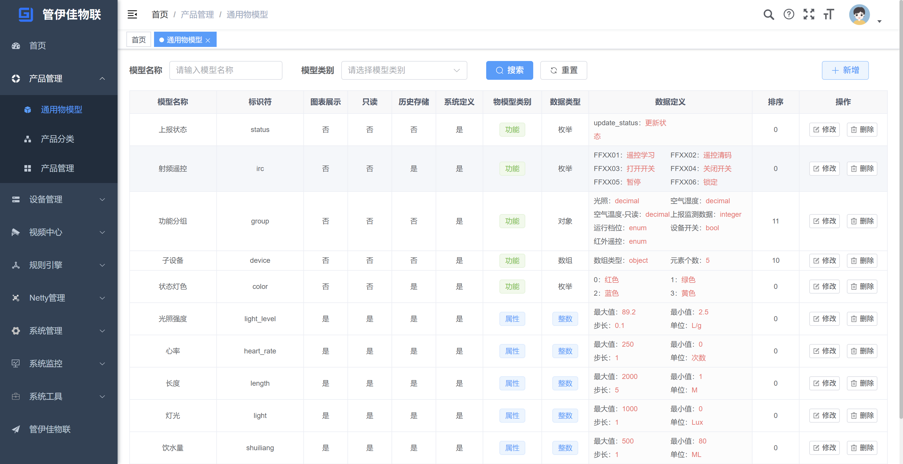
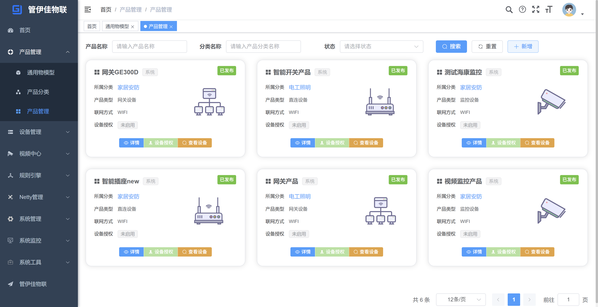
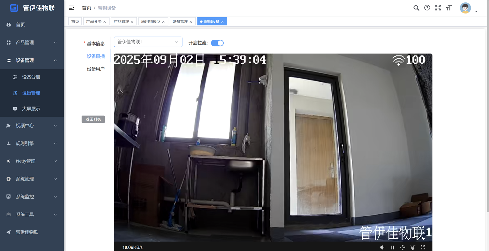
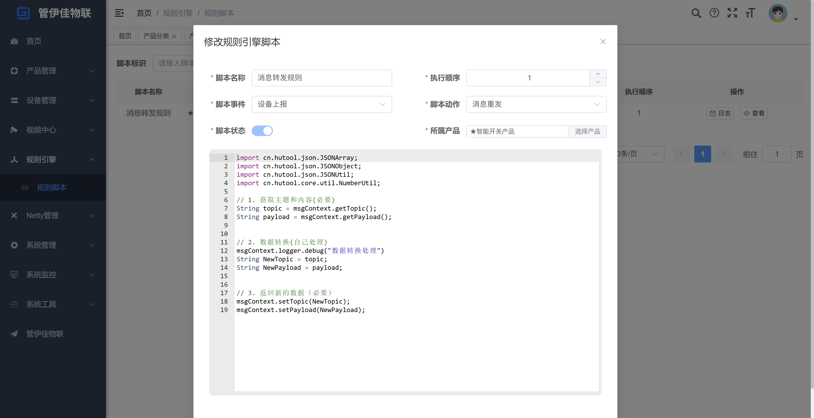

# 管伊佳物联

#### 项目介绍
管伊佳物联平台，简单易用，更适合中小企业和个人学习使用。喜欢就点个小星星哦！

适用于智慧工业、智能家居、智慧景区、智慧社区、智慧校园、农业监测、水利监测等。

深耕物联网行业多年，专业提供物联网解决方案，可信赖的智慧工业物联网伙伴。

系统后端采用Spring boot2.5；前端采用Vue3.4；Mqtt服务端使用netty搭建；

数据库采用Mysql8.0.24；设备端支持ESP8266、Modbus、GB28181等。

平台地址：http://iot.gyjerp.com  演示账号：gyj  密码：gyj123 欢迎进行试用体验！

QQ技术交流群：818914680 欢迎加入，一起学习！商务或技术交流，请联系微信：shenhua861584 QQ：752718920

#### 软件架构
* 服务端
- 相关技术：Spring boot2.5、MyBatis3.5、Spring Security、Mysql、Redis、Netty等
- 开发工具：IDEA
* Web端
- 相关技术：Vue3.4、Element-plus2.4、ES6、Vue-router、Vite、Axios、Echart等
- 开发工具：WebStorm 或者 Visual Studio Code

#### 系统功能

|           系统功能           | 功能说明                                            | 
|:------------------------:|:-----------------------------------------------:|
|           产品管理           | 通用物模型、产品分类、产品详情、设备授权、产品模型                       | 
|           设备管理           | 设备分组、设备详情、运行状态、设备定时、设备用户、事件日志、指令日志            | 
|          大屏展示           | 设备总览、设备分布、mqtt状态、mqtt消息、设备提醒、监测数据          | 
|          视频接入          | 基于GB28181协议支持主流厂商监控设备接入，实时播放| 
|          规则引擎          | 规则脚本、日志查看           | 
|          Netty管理          | 客户端、Mqtt统计 | 
|          权限管理          | 基于若依的权限管理系统，用户、角色、菜单、部门、岗位、权限、日志等  | 

#### 参与贡献

1.  Fork 本仓库
2.  新建 Feat_xxx 分支
3.  提交代码
4.  新建 Pull Request

#### 系统截图
* 首页

* 通用物模型

* 产品管理

* 设备管理

* 监控直播

* 规则脚本

* Mqtt统计

* 权限管理

